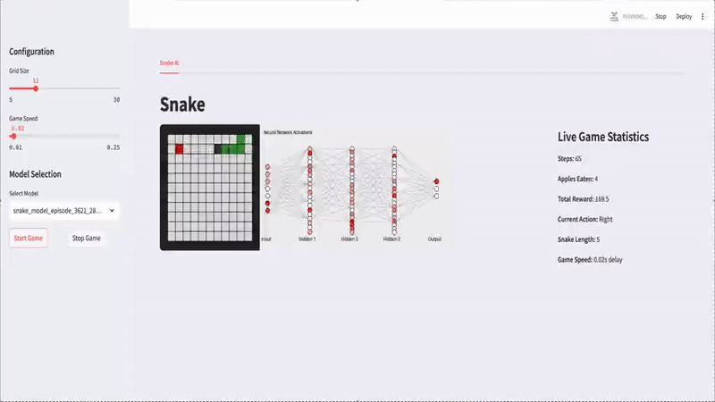

# RL-Snake

A reinforcement learning implementation of the classic Snake game.



## Overview

This project implements a reinforcement learning agent that learns to play Snake. The agent is trained to maximize its score by collecting food while avoiding collisions with walls and its own body. Created a small application using streamlit to showcase the agent as well as a visualisation of the neural network in action.

## Technical Details

- **Framework**: Streamlit
- **Algorithms**: Deep Q-Learning
- **State Representation**: Grid-based environment state
- **Action Space**: Discrete (Left, Right, Forward)

## Installation

```
pip install -r requirements.txt
```

## Usage

To run the application:

```
streamlit run app.py
```

## Training Process

The agent was trained using an epsilon-greedy strategy with the following parameters:
- Learning rate: 0.001
- Discount factor: 0.99
- Epsilon decay: 0.995
- Replay memory size: 10000

## License

MIT